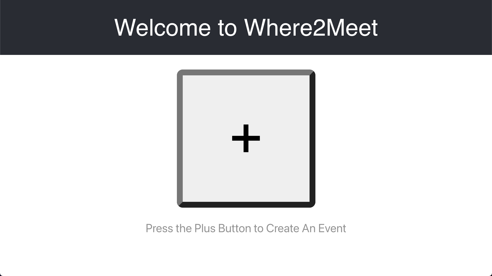
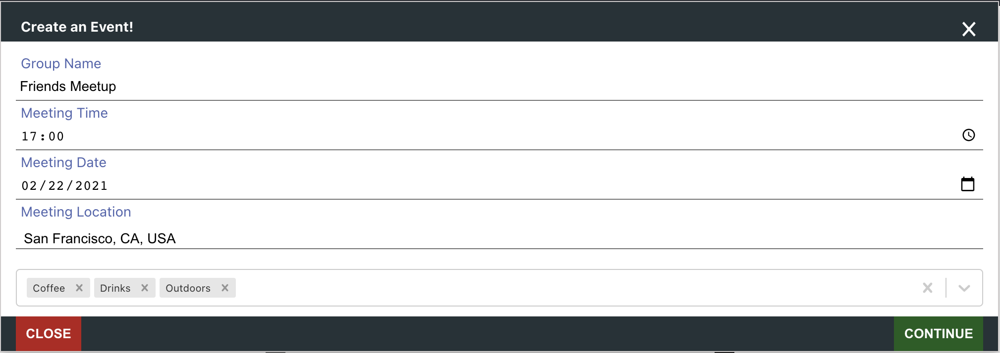
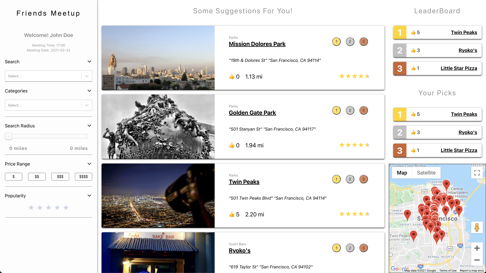
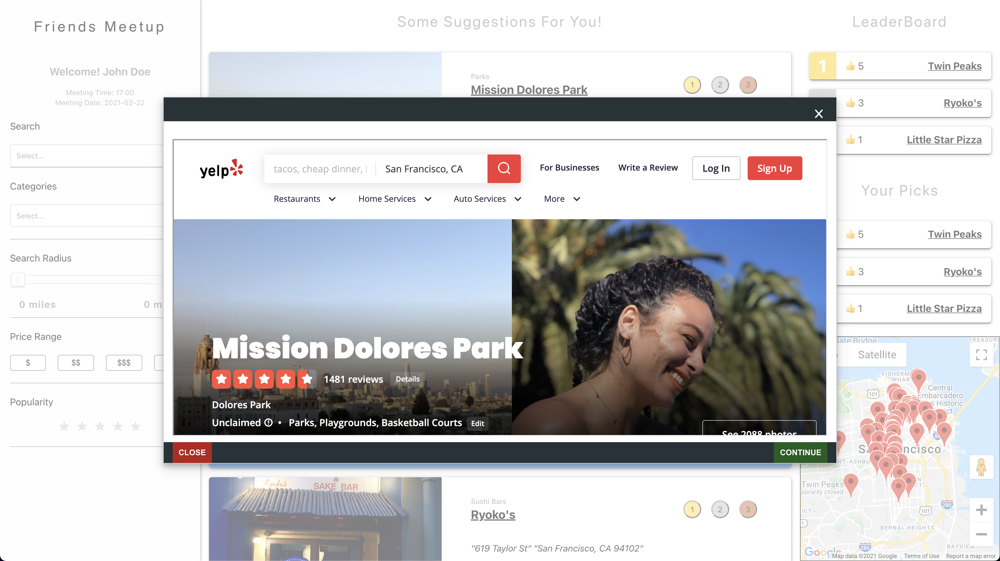

# Where2Meet

## About
The motivation for this project was to create an easy way for people to find the best place to meet up with friends. In order to do this, we designed an app that recommends venues based on a variety of factors such as the type of venue the user wants, the area they are in, and the time they are meeting. Users are able to create a group and send a link to their friends who can view results, filter them based on distance, price, and type of venue, and vote on their top three choices. As everyone votes, the leaderboard of the top three choices is displayed so everyone knows what the top choices are.

### Features
- Real-time leaderboard rankings updated using websockets
- Backend API features a SQL database with caching to facilitate quick data access
- Frontend uses React.js with Google Maps integration featuring real-time filtering and sorting of data

## Screenshots
The initial login page displayed to the user:

The popup to enter initial event information:

The homepage with a scroll pane in the center, filtering options on the left, and leaderborard info on the right:

A modal that users can select to view more yelp information when clicking on a venue:

